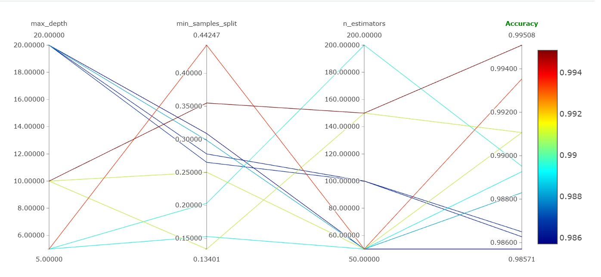
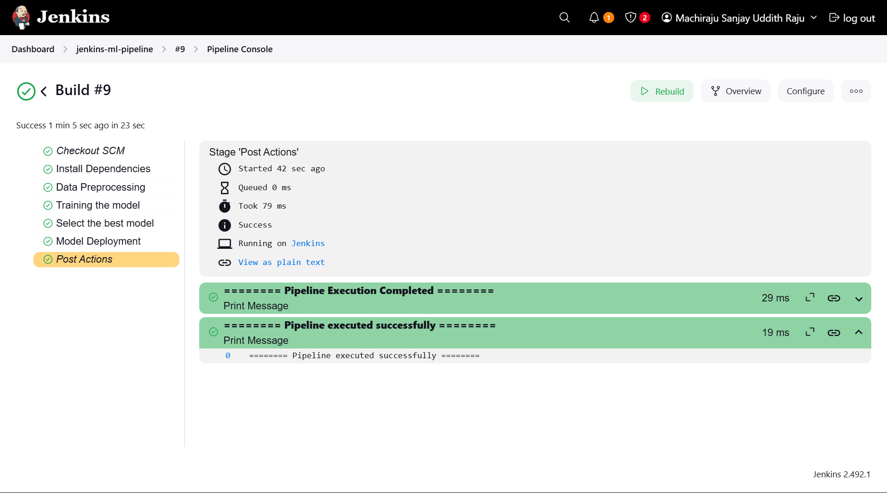

# Jenkins ML Pipeline
This project automates the end-to-end machine learning training pipeline using Jenkins, ensuring seamless integration and automation. When new data arrives or code is updated, the pipeline automatically preprocesses the data, trains a machine learning model, evaluates its performance, saves the model with versioning, and logs the entire workflow.

Hyperparameter tuning visualization using mlflow, showing the relationship between max_depth, min_samples_split, n_estimators, and model accuracy.

Jenkins pipeline successfully executes the ML workflow, including data preprocessing, model training, and deployment.  
Build logs confirm all stages completed without errors, ensuring a seamless CI/CD process.  

